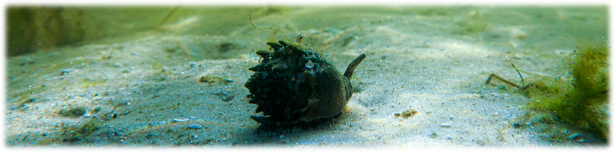
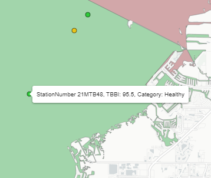
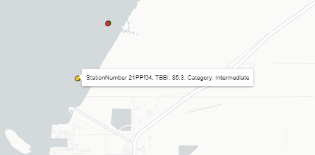

```{r setup, include=F}
knitr::opts_chunk$set(echo = F, message = F, warning = F)

box::use(
  dplyr[`%>%`]
)

cols <- c('#CC3231', '#E9C318', '#2DC938')

maxyr <- 2021
 
data('sedimentdata', package = 'tbeptools')
load(file = 'data/tbbiscr.RData')
load(file = 'data/benpts.RData')
load(file = 'data/benmed.RData')
load(file = 'data/segs.RData')
load(file = 'data/prmlkup.RData')
load(file = 'data/tbbimat.RData')
load(file = 'data/spedat.RData')
load(file = 'data/pelsum.RData')
```

```{r reactives}
# benthic matrix
benmat <- reactive({
  
  # input
  yrsel1 <- input$yrsel1

  lwid <- 1.5
  
  # base matrix with selected year
  p <- tbbimat +
    ggplot2::geom_hline(yintercept = yrsel1 - 0.5, lwd = lwid) + 
    ggplot2::geom_hline(yintercept = yrsel1 + 0.5, lwd = lwid) + 
    ggplot2::geom_segment(ggplot2::aes(x = 0.5, xend = 0.5, y = yrsel1 - 0.5, yend = yrsel1 + 0.5, lwd = lwid)) +
    ggplot2::geom_segment(ggplot2::aes(x = 9.5, xend = 9.5, y = yrsel1 - 0.5, yend = yrsel1 + 0.5, lwd = lwid))
  
  out <- tbeptools::show_matrixplotly(p, tooltip = 'Action')
  
  return(out)

})

benmap <- leaflet::leafletProxy('benmap')

# benthic index map
observe({
  
  # inputs
  yrsel1 <- input$yrsel1
  req(yrsel1)

  # polygons
  benpol <- benmed %>% 
    dplyr::filter(yr == yrsel1) %>% 
    dplyr::inner_join(segs, ., by = 'bay_segment')
  
  # points
  benpts <- benpts %>% 
    dplyr::filter(yr == yrsel1) %>% 
    dplyr::filter(FundingProject == 'TBEP')
  
  # map with custom legends
  benmap %>% 
    leaflet::clearMarkers() %>% 
    leaflet::clearShapes() %>% 
    leaflet::addPolygons(
      data = benpol, 
      stroke = T, 
      color = 'grey', 
      weight = 1, 
      layerId = ~bay_segment, 
      fillColor = ~outcome, 
      fillOpacity = 0.3,
      label = ~paste0(bay_segment, ': ', long_name, ', TBBI: ', TBBICat)
    ) %>% 
    leaflet::addCircleMarkers(
      data = benpts, 
      layerId = ~StationID,
      stroke = TRUE,
      color = 'black',
      fill = TRUE,
      fillColor = ~outcome,
      weight = 1,
      fillOpacity = 1,
      radius= 4,
      label = ~paste0('StationNumber ', StationNumber, ', TBBI: ', round(TBBI, 1), ', Category: ', TBBICat)
    )
  
})

# sediment plot
sedplo <- reactive({
  
  # inputs
  typsel <- input$typsel
  prmsel <- input$prmsel
  yrsel2 <- input$yrsel2
  
  if(typsel == 'PEL summary'){
    
    out <- try(tbeptools::show_sedimentpelave(sedimentdata, yrrng = yrsel2, plotly = T), silent = T)
    
  }
  
  if(typsel != 'PEL summary'){
    
    req(prmsel)

    out <- try(tbeptools::show_sedimentave(sedimentdata, param = prmsel, yrrng = yrsel2, plotly = T), silent = T)
    
  }
  
  validate(
    need(!inherits(out, 'try-error'), 'No data')
  )
  
  return(out)
  
})

# sediment map
sedmap <- reactive({
  
  # inputs
  typsel <- input$typsel
  prmsel <- input$prmsel
  yrsel2 <- input$yrsel2
  sedmaploc <- isolate(sedmaploc()) # fucking important!
  
  if(typsel == 'PEL summary'){
    
    out <- tbeptools::show_sedimentpelmap(sedimentdata, yrrng = yrsel2)  
    
  }
  
  if(typsel != 'PEL summary'){
    
    req(prmsel)
    
    out <- try(tbeptools::show_sedimentmap(sedimentdata, param = prmsel, yrrng = yrsel2), silent = TRUE)
    
    validate(
      need(!inherits(out, 'try-error'), 'No data')
    )
    
  }

  if(length(sedmaploc) != 0)
    out <- out %>%
      leaflet::setView(lng = sedmaploc$lng, lat = sedmaploc$lat, zoom = sedmaploc$zoom)

  return(out)
  
})

# sediment dynamic location
sedmaploc <- reactive({

  if(is.null(input$sedmap_center))
    return(list())

  list(
    zoom = input$sedmap_zoom,
    lat = input$sedmap_center$lat,
    lng = input$sedmap_center$lng
  )

})

# special study table
spedattab <- reactive({

  yrsel3 <- input$yrsel3
  
  # input
  totab <- spedat %>% 
    dplyr::filter(Year >= yrsel3[1] & Year <= yrsel3[2]) %>% 
    dplyr::arrange(-Year)
  
  out <- reactable::reactable(totab,
    defaultColDef = reactable::colDef(
      footerStyle = list(fontWeight = "bold"),
      format = reactable::colFormat(digits = 0, separators = F),
      align = 'left',
      resizable = TRUE
    ),
    defaultPageSize = nrow(totab)
    )
  
  return(out)
  
})

# sediment special plot
sedspeplo <- reactive({
  
  # inputs
  typsel2 <- input$typsel2
  prmsel2 <- input$prmsel2
  yrsel3 <- input$yrsel3
  
  if(typsel2 == 'PEL summary'){
    
    out <- try(tbeptools::show_sedimentpelave(sedimentdata, yrrng = yrsel3, plotly = T, funding_proj = 'TBEP-Special', ylim = c(0, NA)), silent = T)
    
  }
  
  if(typsel2 != 'PEL summary'){
    
    req(prmsel2)

    out <- try(tbeptools::show_sedimentave(sedimentdata, param = prmsel2, yrrng = yrsel3, plotly = T, funding_proj = 'TBEP-Special'), silent = T)
    
  }
  
  validate(
    need(!inherits(out, 'try-error'), 'No data')
  )
  
  return(out)
  
})

# sediment special map
sedspemap <- reactive({
  
  # inputs
  typsel2 <- input$typsel2
  prmsel2 <- input$prmsel2
  yrsel3 <- input$yrsel3
  sedspemaploc <- isolate(sedspemaploc())

  if(typsel2 == 'PEL summary'){
    
    out <- tbeptools::show_sedimentpelmap(sedimentdata, yrrng = yrsel3, funding_proj = 'TBEP-Special')  
    
  }
  
  if(typsel2 != 'PEL summary'){
    
    req(prmsel2)
    
    out <- try(tbeptools::show_sedimentmap(sedimentdata, param = prmsel2, yrrng = yrsel3, funding_proj = 'TBEP-Special'), silent = T)
    
    validate(
      need(!inherits(out, 'try-error'), 'No data')
    )
    
  }

  if(length(sedspemaploc) != 0)
    out <- out %>%
      leaflet::setView(lng = sedspemaploc$lng, lat = sedspemaploc$lat, zoom = sedspemaploc$zoom)
  
  return(out)
  
})

# sediment special dynamic location
sedspemaploc <- reactive({

  if(is.null(input$sedspemap_center))
    return(list())

  list(
    zoom = input$sedspemap_zoom,
    lat = input$sedspemap_center$lat,
    lng = input$sedspemap_center$lng
  )

})

# benthic special map
benspemap <- reactive({
  
  # inputs
  yrsel3 <- input$yrsel3
  benspemaploc <- isolate(benspemaploc())

  req(yrsel3)
  
  # points
  benptsyr <- benpts %>% 
    dplyr::filter(yr >= yrsel3[1] & yr <= yrsel3[2]) %>% 
    dplyr::filter(FundingProject == 'TBEP-Special')
  
  bbx <- as.numeric(sf::st_bbox(benptsyr))

  out <- mapview::mapView(map.types = mapview::mapviewGetOption("basemaps")) %>%
    .@map %>%
    leaflet::addLegend("topright", labels = c("Healthy", "Intermediate", "Degraded"), colors = rev(cols), title = "TBBI Category", opacity = 1) %>%
    leaflet::addCircleMarkers(
      data = benptsyr,
      layerId = ~StationID,
      stroke = TRUE,
      color = 'black',
      fill = TRUE,
      fillColor = ~outcome,
      weight = 1,
      fillOpacity = 1,
      radius= 4,
      label = ~paste0('StationNumber ', StationNumber, ', TBBI: ', round(TBBI, 1), ', Category: ', TBBICat)
    ) %>%
    leaflet::fitBounds(lng1 = bbx[1], lat1 = bbx[2], lng2 = bbx[3], lat2 = bbx[4])

  if(length(benspemaploc) != 0)
    out <- out %>%
      leaflet::setView(lng = benspemaploc$lng, lat = benspemaploc$lat, zoom = benspemaploc$zoom)

  return(out)
  
})

# benthic special dynamic location
benspemaploc <- reactive({

  if(is.null(input$benspemap_center))
    return(list())

  list(
    zoom = input$benspemap_zoom,
    lat = input$benspemap_center$lat,
    lng = input$benspemap_center$lng
  )

})

# download data
dldat <- reactive({
  
  typseldl <- input$typseldl
  prmseldl <- input$prmseldl
  yrseldl <- input$yrseldl
  
  out <- NULL
  
  if(typseldl == 'TBBI bay segment')
    out <- benmed %>% 
      dplyr::select(-outcome)
  
  if(typseldl ==  'TBBI stations')
    out <- tbbiscr %>% 
      dplyr::select(-ProgramID) %>% 
      dplyr::filter(AreaAbbr %in% c("OTB", "HB", "MTB", "LTB", "TCB", "MR", "BCB"))

  if(typseldl == 'PEL summary')
    out <- pelsum

  if(!typseldl %in% c('TBBI bay segment', 'TBBI stations', 'PEL summary') & !is.null(prmseldl))
    out <- sedimentdata %>% 
      tbeptools::anlz_sedimentaddtot(pelave = FALSE) %>% 
      dplyr::filter(Parameter == prmseldl) %>% 
      dplyr::select(-MDLnum, -PQLnum, -ProgramId, -BetweenTELPEL, -ExceedsPEL, -PELRatio, -PreparationDate, -AnalysisTimeMerge, -SedResultsType) %>% 
      dplyr::filter(AreaAbbr %in% c("OTB", "HB", "MTB", "LTB", "TCB", "MR", "BCB")) %>% 
      dplyr::arrange(yr, StationID)

  req(!is.null(out))
  
  out <- out %>% 
    dplyr::filter(yr >= yrseldl[1] & yr <= yrseldl[2])
  
  return(out)
  
})
  
# reactable table
dltab <- reactive({
  
  dldat <- dldat()

  out <- reactable::reactable(dldat,
    columns = list(
      yr = reactable::colDef(format = reactable::colFormat(digits = 0)), 
      StationID = reactable::colDef(format = reactable::colFormat(digits = 0))
    ),
    defaultColDef = reactable::colDef(
      footerStyle = list(fontWeight = "bold"),
      format = reactable::colFormat(digits = 3, separators = F),
      resizable = TRUE, 
      align = 'left'
    ),
    filterable = T,
    defaultPageSize = 15
    )
  
  return(out)
  
})
```

```{r downloadhandlers}
# download transect table
output$dwnld <- downloadHandler(
  filename = function(){'benthicdata.csv'},
  content = function(file){
    
    # inputs
    dldat <- dldat()
    
    write.csv(dldat, file, quote = T, row.names = F)
    
  }
)
```

OVERVIEW
===========================================================

Column {.tabset .tabset-fade data-width=650}
-----------------------------------------------------------------------

### USING THE DASHBOARD

<div class = "row">
<div class = "col-md-2"></div>
<div class = "col-md-8">

#### WELCOME TO THE TAMPA BAY BENTHIC DASHBOARD!

```{r, echo = F, out.width = '100%', fig.align = 'center'}

```

This dashboard summarizes over twenty-five years of benthic data from Tampa Bay, Florida.  All data were collected by staff from the Environmental Protection Commission of Hillsborough County.  The data provide information on the organisms living in or near the bay bottom and contaminants of concern in the sediment.  The condition of the bay bottom is one of several indicators used by the Tampa Bay Estuary Program to assess overall health of the bay. The different pages under the __PAGE SELECTION__ menu can be used to view synthesized results from the benthic data:

1) [__TAMPA BAY BENTHIC INDEX__](#tampa-bay-benthic-index): View annual summaries by major bay segments for the Tampa Bay Benthic Index (TBBI)
1) [__SEDIMENT CONTAMINANTS__](#sediment-contaminants): View summaries of sediment contaminant concentrations
1) [__SPECIAL STUDY SITES__](#special-study-sites-1): View results for special study sites for the Tampa Bay Estuary Program, including benthic index and contaminant results
1) [__DATA DOWNLOADS__](#data-downloads): Download TBBI scores or sediment contaminant data

The plots in this dashboard are interactive and display options can be controlled using a mouse. Most plots include a [control menu](https://help.plot.ly/zoom-pan-hover-controls/){target="_blank"} on the top with different options for viewing the data.  For example, click the camera icon to download a plot.

<br>
```{r, fig.align='center', out.width='30%'}
knitr::include_graphics('www/plotcontrols.PNG')
```
<br>

#### Data sources

Source data used on this website were obtained from the benthic monitoring program administered by the Environmental Protection Commission of Hillsborough County, with support from Pinellas and Manatee County. Original data can be accessed [here](https://epcbocc.sharepoint.com/:f:/s/Share/EtOJfziTTa9FliL1oROb9OsBRZU-nO60fu_0NRC162hHjQ?e=4gUXgJ){target="_blank"}. Data provided on the dashboard are made available for exploratory purposes only. Please consult the [25-year report](https://drive.google.com/file/d/1XqwAbvhSRSDMHyGhVtrUTZpVmPqkFsWI/view){target="_blank"} for a comprehensive summary of the benthic monitoring data.   

```{r, fig.align='center', out.width='60%'}

```

#### Website information

<a href="https://tbep-tech.github.io/tbeptools/articles/tbbi.html" target="__blank" rel="noopener noreferrer"></a>

The page source content can be viewed on [Github](https://github.com/tbep-tech/benthic-dash){target="_blank"}. Nearly all of the data, tables, and plots were created using functions in the [tbeptools](https://tbep-tech.github.io/tbeptools){target="_blank"} R software package.  Please see the [vignette](https://tbep-tech.github.io/tbeptools/articles/tbbi.html){target="_blank"} for a detailed overview of how you can use these functions on your own to work with the data. 

Questions and comments about the dashboard can be sent to [Marcus Beck](mailto:mbeck@tbep.org). Like this app? Share it on social media using the [\#TampaBayOpenSci](https://twitter.com/hashtag/TampaBayOpenSci?src=hashtag_click){target="_blank"} hashtag.  

Citation info here: [](https://zenodo.org/badge/latestdoi/589592689){target="_blank"}

<a rel='license' href='http://creativecommons.org/licenses/by/4.0/' target='_blank'></a>&nbsp;&nbsp;This website is licensed under a <a rel='license' href='http://creativecommons.org/licenses/by/4.0/' target='_blank'>Creative Commons Attribution 4.0 International License</a>.

</div>
<div class = "col-md-2"></div>
</div>

### METHODS

<div class = "row">
<div class = "col-md-2"></div>
<div class = "col-md-8">

#### How to understand and use the benthic data

Benthic invertebrates are a group of relatively small organisms that live the majority of their life cycles in or near bay bottom sediments. They are a food source for small fish and crustaceans and can provide water quality benefits through sediment removal during feeding. Tampa Bay supports many different benthic organisms. The organisms at any location vary depending on the salinity, sediment type, temperature, dissolved oxygen, and presence of excess nutrients and/or toxic contaminants.

Benthic data provide critical information on the health of organisms that live in or near the bay bottom and how they respond to contaminants of concern in the sediment.  The data are synthesized to communicate the results in an easily interpretable format.  The summaries on this dashboard are shown using the Tampa Bay Benthic Index (TBBI) and contaminant concentrations relative to thresholds of interest.  Special study sites for the Tampa Bay Estuary Program are also shown.  Note that benthic samples require approximately one year of processing and the most recent year on the dashboard will typically lag the present year. 

#### Benthic index

The TBBI provides an estimate of the health of benthic communities in Tampa Bay. The TBBI is scaled from 0-100 with values <73 classified as <span style="color:#CC3231">__Degraded__</span>, from 73-87 as <span style="color:#E9C318">__Intermediate__</span>, and >87 as <span style="color:#2DC938">__Healthy__</span>. These classifications are assigned to individual sampling stations in Tampa Bay. Collectively, bay segments are assigned to categories of <span style="color:#CC3231">__Poor__</span>, <span style="color:#E9C318">__Fair__</span>, and <span style="color:#2DC938">__Good__</span> based on the distribution of classifications across all stations in each segment. This information provides a general summary of benthic community health across the bay.  These results are shown on the [__TAMPA BAY BENTHIC INDEX__](#tampa-bay-benthic-index) tab. 

#### Contaminant data

In addition to biological data, sediment contaminant concentrations are measured at sites within Tampa Bay. These include over 100 different constituents grouped broadly as metals, organics, or other. The concentrations of these constituents can be compared relative to Threshold Effects Levels (TEL) or Potential Effects Levels (PEL), when available, as relative indications of the likelihood that the concentrations will have toxic effects on invertebrates that inhabit the sediments.

* __Threshold Effects Levels (TEL)__: Concentration at which a toxic response has started to be observed in benthic organisms
* __Potential Effects Levels (PEL)__: Concentration at which a large percentage of the benthic population shows a toxic response

The TEL or PEL values are specific to each contaminant.  They can be evaluated separately for each contaminant or combined across contaminants as an overall assessment. The latter is called the PEL summary ratio, which can be shown as a proportion in the summary plots or as graded categories for sites on the maps. These results are shown on the [__SEDIMENT CONTAMINANTS__](#sediment-contaminants) tab.   

#### Special study sites

Finally, the Tampa Bay Estuary Program requests special study sites to be monitored each year, in addition to the routine sites covered by the Environmental Protection Commission of Hillsborough County. These sites typically focus on areas of interest each year that may not be adequately covered by the routine monitoring.  Benthic and contaminant data are collected at these sites. These results are shown on the [__SPECIAL STUDY SITES__](#special-study-sites-1) tab.

Additional information on the benthic monitoring program can be found [here](https://drive.google.com/file/d/1XqwAbvhSRSDMHyGhVtrUTZpVmPqkFsWI/view?usp=drivesdk){target="_blank}.  

</div>
<div class = "col-md-2"></div>
</div>

1 TAMPA BAY BENTHIC INDEX {data-navmenu="PAGE SELECTION"}
===========================================================

Column {.tabset .tabset-fade data-width=275}
-----------------------------------------------------------------------

### MATRIX RESULTS

```{r}
output$benmat <- plotly::renderPlotly(benmat())
plotly::plotlyOutput('benmat')
```

### Using this tab

This tab shows the overall assessment of Tampa Bay Benthic Index (TBBI) scores for each bay segment across all years when data were available. The TBBI provides an estimate of the health of benthic communities in Tampa Bay. The TBBI is scaled from 0-100 with values <73 classified as <span style="color:#CC3231">__Degraded__</span>, from 73-87 as <span style="color:#E9C318">__Intermediate__</span>, and >87 as <span style="color:#2DC938">__Healthy__</span>. These classifications are assigned to individual sampling stations in Tampa Bay. Collectively, bay segments are assigned to categories of <span style="color:#CC3231">__Poor__</span>, <span style="color:#E9C318">__Fair__</span>, and <span style="color:#2DC938">__Good__</span> based on the distribution of classifications across all stations in each segment. 

The __MATRIX RESULTS__ show the TBBI scores each year for each segment, which are based on the distribution of site scores in each segment. The black rectangle shows the selected year from the year slider above the map. The bay segments shown at the top of the matrix are as follows:

* __OTB__: Old Tampa Bay
* __HB__: Hillsborough Bay
* __MTB__: Middle Tampa Bay
* __LTB__: Lower Tampa Bay
* __TCB__: Terra Ceia Bay
* __MR__: Manatee River
* __BCB__: Boca Ciega Bay

Combined results are also shown for the whole bay (__All__) and for the whole bay weighted (__All (wt)__) by the relative areas of each bay segment.

Placing the cursor over the matrix will show the outcome category assigned to each segment and year. 

```{r, out.width='30%', fig.align='center'}

```
<br>

In the above example, the category for Hillsborough Bay in 1995 was <span style="color:#CC3231">__Poor__</span>.  

The __MAP SUMMARY__ on the right shows the segment outcome categories from the matrix using color in the segment polygons and the stations (points) used to estimate the segment outcome.  Note that the segment outcome categories for the TBBI are characterized as <span style="color:#CC3231">__Poor__</span>, <span style="color:#E9C318">__Fair__</span>, and <span style="color:#2DC938">__Good__</span>, whereas the station scores are categorized as <span style="color:#CC3231">__Degraded__</span>, <span style="color:#E9C318">__Intermediate__</span>, and <span style="color:#2DC938">__Healthy__</span>. 

Placing the cursor over the segment or station will reveal additional information. 

<br>
```{r, out.width='50%', fig.align='center'}

```
<br>

The year slider on the top can be used to select which year is shown on the map. A reference box on the *MATRIX RESULTS* tab shows which year is selected. Selecting the play button will cycle through all years in the data, with the maps and plots updating with each year. 


Column {data-width=500}
-----------------------------------------------------------------------

### MAP SUMMARY

```{r}
bbx <- sf::st_bbox(segs) %>%
  as.numeric()

tbbiscryr <- tbbiscr %>%
  dplyr::filter(yr == maxyr)
benmedyr <- benmed %>%
  dplyr::filter(yr == maxyr) %>%
  dplyr::inner_join(segs, ., by = 'bay_segment')
benptsyr <- benpts %>%
  dplyr::filter(yr == maxyr)

# benmapbs
benmapbs <- mapview::mapView(map.types = mapview::mapviewGetOption("basemaps")) %>%
  .@map %>%
  leaflet::fitBounds(lng1 = bbx[1], lng2 = bbx[3], lat1 = bbx[2], lat2 = bbx[4]) %>%
  leaflet::addLegend("topright", labels = c("Good", "Fair", "Poor"), colors = rev(cols), title = "TBBI Category", opacity = 1) %>%
  leaflet::addPolygons(
    data = benmedyr,
    stroke = T,
    color = 'grey',
    weight = 1,
    layerId = ~bay_segment,
    fillColor = ~outcome,
    fillOpacity = 0.3,
    label = ~paste0(bay_segment, ': ', long_name, ', TBBI: ', TBBICat)
  ) %>%
  leaflet::addCircleMarkers(
    data = benptsyr,
    layerId = ~StationID,
    stroke = TRUE,
    color = 'black',
    fill = TRUE,
    fillColor = ~outcome,
    weight = 1,
    fillOpacity = 1,
    radius= 4,
    label = ~paste0('StationNumber ', StationNumber, ', TBBI: ', round(TBBI, 1), ', Category: ', TBBICat)
  )
output$benmap <- leaflet::renderLeaflet(benmapbs)

tags$style(HTML(".js-irs-0 .irs-single-0, .js-irs-0 .irs-bar-edge-0, .js-irs-0 .irs-bar, .js-irs-0 .irs-line {background: #E5E5E5 !important; border: 1px #E5E5E5 !important;}"))
fillCol(flex = c(NA, 1),
  column(12,
    column(6,
      sliderInput('yrsel1', 'Select year:', min = 1993, max = maxyr, value = maxyr, step = 1, sep = '', width = '200%', animate = T),
    )
  ),
  leaflet::leafletOutput('benmap')
)
```

2 SEDIMENT CONTAMINANTS {data-navmenu="PAGE SELECTION"}
===========================================================

Column {.tabset .tabset-fade data-width=275}
-----------------------------------------------------------------------

### SEDIMENT SUMMARY RESULTS

```{r}
output$sedplo <- plotly::renderPlotly(sedplo())
plotly::plotlyOutput('sedplo')
```

### Using this tab

This tab shows sediment contaminant concentrations measured at sites within Tampa Bay.  These include over 100 different constituents grouped broadly as metals, organics, or other. The concentrations of these constituents can be compared relative to different thresholds as an indication of the likelihood that the concentrations will have toxic effects on invertebrates that inhabit the sediments.  The two relevant thresholds are:

* __Threshold Effects Levels (TEL)__: Concentration at which a toxic response has started to be observed in benthic organisms
* __Potential Effects Levels (PEL)__: Concentration at which a large percentage of the benthic population shows a toxic response

The TEL and PEL values are specific to each contaminant and follow sediment quality guidelines established for Florida.  Values are not available for all contaminants.  Additionally, the proportion of contaminants that exceed the PEL value at a site can be assessed as the PEL ratio summary, which can be shown as a proportion on the summary plot or as a graded category on the map.  Both the __SEDIMENT SUMMARY RESULTS__ and the __MAP SUMMARY__ can be used to assess the PEL summary or individual contaminants relative to TEL/PEL values. 

The __SEDIMENT SUMMARY RESULTS__ show a summary of PEL ratio summaries or selected contaminants by bay segment.  The summaries show the average and 95% confidence interval, with bay segment abbreviations as follows:

* __OTB__: Old Tampa Bay
* __HB__: Hillsborough Bay
* __MTB__: Middle Tampa Bay
* __LTB__: Lower Tampa Bay
* __TCB__: Terra Ceia Bay
* __MR__: Manatee River
* __BCB__: Boca Ciega Bay

Depending on the selection, horizontal lines on the plot show either the breakpoints for the PEL ratio summary grades or the applicable TEL/PEL values for the selected contaminant.  A gray horizontal line shows the grand mean across all bay segments.  Contaminants that do not have TEL/PEL values show only summaries of the averages and their confidence intervals.  

Placing the cursor over a point on the plot will show additional information about the summaries.  

<br>
```{r, out.width='30%', fig.align='center'}

```
<br>

The __MAP SUMMARY__ provides a spatial representation of the sites that are summarized in the __SEDIMENT SUMMARY RESULTS__ tab. Each point represents a station that was sampled, with the color depending on selection.  PEL ratio summary grades are shown if the PEL summary is selected.  If an individual contaminant is selected, the points will be colored if they are below the TEL, between the TEL/PEL, or above the PEL.  The concentration of the contaminant will be shown as a continuous color relative to all other stations if TEL/PEL vales are not available for a contaminant.  

Placing the cursor over a point on the map will show additional information about the station.  

<br>
```{r, out.width='80%', fig.align='center'}

```
<br>

The year range slider at the top determines which stations are used for the summary plot in the __SEDIMENT SUMMARY RESULTS__ tab and on the map in the __MAP SUMMARY__ tab. 

Column {data-width=500}
-----------------------------------------------------------------------

### MAP SUMMARY

```{r}
output$sedmap <- leaflet::renderLeaflet(sedmap())
fillCol(flex = c(NA, 1),
  column(12,
    column(3, 
      selectInput('typsel', 'Select type:', choices = c('PEL summary', c(unique(prmlkup$SedResultsType))))
    ),
    column(3, 
      renderUI({
        typsel <- input$typsel
        
        req(typsel)
        req(typsel != 'PEL summary')
        
        tosel <- prmlkup %>% 
          dplyr::filter(SedResultsType == typsel) %>% 
          dplyr::pull(Parameter)
        
        selectInput('prmsel', 'Select parameter:', choices = tosel)
        
      })
    ),
    column(6,
      sliderInput('yrsel2', 'Select year range:', min = 1993, max = maxyr, value = c(1993, maxyr), step = 1, sep = '', width = '200%'),
    )
  ),
  leaflet::leafletOutput('sedmap')
)
```

3 SPECIAL STUDY SITES {data-navmenu="PAGE SELECTION"}
===========================================================

Column {.tabset .tabset-fade data-width=275}
-----------------------------------------------------------------------

### SPECIAL STUDY SITES

```{r}
output$spedattab <- reactable::renderReactable(spedattab())
reactable::reactableOutput('spedattab')
```

### SEDIMENT SUMMARY RESULTS

```{r}
output$sedspeplo <- plotly::renderPlotly(sedspeplo())
plotly::plotlyOutput('sedspeplo')
```

### Using this tab

This tab shows sediment contaminant concentrations and Tampa Bay Benthic Index (TBBI) scores for special study sites within Tampa Bay. The Tampa Bay Estuary Program requests special study sites to be monitored each year, in addition to the routine sites covered by the Environmental Protection Commission of Hillsborough County shown in the other tabs. These sites typically focus on areas of interest each year that may not be adequately covered by the routine monitoring.

Results for the special study sites are shown in two tabs on the left, where a table of sites each year is shown in __SPECIAL STUDY SITES__ and summarized results are shown in __SEDIMENT SUMMARY RESULTS__.  The maps on the right show sediment contaminant summaries in the left map and TBBI scores in the right map.  

Sediment concentration data includes information on over 100 different constituents grouped broadly as metals, organics, or other. The concentrations of these constituents can be compared relative to different thresholds as an indication of the likelihood that the concentrations will have toxic effects on invertebrates that inhabit the sediments.  The two relevant thresholds are:

* __Threshold Effects Levels (TEL)__: Concentration at which a toxic response has started to be observed in benthic organisms
* __Potential Effects Levels (PEL)__: Concentration at which a large percentage of the benthic population shows a toxic response

The TEL and PEL values are specific to each contaminant and follow sediment quality guidelines established for Florida.  Values are not available for all contaminants.  Additionally, the proportion of contaminants that exceed the PEL value at a site can be assessed as the PEL ratio summary, which can be shown as a proportion on the summary plot or as a graded category on the map.  Both the __SEDIMENT SUMMARY RESULTS__ and the left map can be used to assess the PEL summary or individual contaminants relative to TEL/PEL values. 

The __SEDIMENT SUMMARY RESULTS__ show a summary of PEL ratio summaries or selected contaminants by bay segment.  The summaries show the average and 95% confidence interval, with bay segment abbreviations as follows:

* __OTB__: Old Tampa Bay
* __HB__: Hillsborough Bay
* __MTB__: Middle Tampa Bay
* __LTB__: Lower Tampa Bay
* __TCB__: Terra Ceia Bay
* __MR__: Manatee River
* __BCB__: Boca Ciega Bay

Depending on the selection, horizontal lines on the plot show either the breakpoints for the PEL ratio summary grades or the applicable TEL/PEL values for the selected contaminant.  A gray horizontal line shows the grand mean across all bay segments.  Contaminants that do not have TEL/PEL values show only summaries of the averages and their confidence intervals.  

Placing the cursor over a point on the plot will show additional information about the summaries.  

<br>
```{r, out.width='30%', fig.align='center'}

```
<br>

The __MAP SUMMARIES__ on the right provide a spatial representation of the special study sites that are summarized in the __SEDIMENT SUMMARY RESULTS__ tab and the TBBI scores. For the sediment summaries on the left map, each point represents a station that was sampled, with the color depending on the selection.  PEL ratio summary grades are shown if the PEL summary is selected.  If an individual contaminant is selected, the points will be colored if they are below the TEL, between the TEL/PEL, or above the PEL.  The concentration of the contaminant will be shown as a continuous color relative to all other stations if TEL/PEL vales are not available for a contaminant. 

Hovering the mouse cursor over each site will reveal additional information, including the station number, which can be useful for identifying which special study sites correspond to each project in a given year.  For example, 2021 Piney Point sites have the PP acronym in the station number, which can also be viewed from the station number acronym column in the table on the __SPECIAL STUDY SITES__ tab.  

<br>
```{r, out.width='80%', fig.align='center'}

```
<br>

The right map shows TBBI scores for the special study sites. The TBBI score at each site is scaled from 0-100 with values <73 classified as <span style="color:#CC3231">__Degraded__</span>, from 73-87 as <span style="color:#E9C318">__Intermediate__</span>, and >87 as <span style="color:#2DC938">__Healthy__</span>.  

The year range slider at the top determines which special study sites are shown in the __SPECIAL STUDY SITES__ table, the summary plot in the __SEDIMENT SUMMARY RESULTS__ tab, and the points in both maps in the __MAP SUMMARIES__ tab.

Column {data-width=500}
-----------------------------------------------------------------------

### MAP SUMMARIES

```{r}
output$sedspemap <- leaflet::renderLeaflet(sedspemap())
output$benspemap <- leaflet::renderLeaflet(benspemap())
fillCol(flex = c(NA, 1),
  column(12,
    column(3, 
      selectInput('typsel2', 'Select type:', choices = c('PEL summary', c(unique(prmlkup$SedResultsType))))
    ),
    column(3, 
      renderUI({
        typsel2 <- input$typsel2
        
        req(typsel2)
        req(typsel2 != 'PEL summary')
        
        tosel <- prmlkup %>% 
          dplyr::filter(SedResultsType == typsel2) %>% 
          dplyr::pull(Parameter)
        
        selectInput('prmsel2', 'Select parameter:', choices = tosel)
        
      })
    ),
    column(6,
      sliderInput('yrsel3', 'Select year:', min = 2002, max = maxyr, value = c(2002, maxyr), step = 1, sep = '', width = '200%'),
    )
  ),
  fillRow(
    fillCol(flex = c(NA, 1), 'Sediment summaries', leaflet::leafletOutput('sedspemap')),
    fillCol(flex = c(NA, 1), 'TBBI summaries', leaflet::leafletOutput('benspemap'))
  )
)
```

4 DATA DOWNLOADS {data-navmenu="PAGE SELECTION"}
===========================================================

Column {.tabset .tabset-fade data-width=650}
-----------------------------------------------------------------------

### DOWNLOAD

```{r}
output$dltabout <- reactable::renderReactable(dltab())
fillCol(flex =c(NA, 1, NA),
  column(12,
    column(3, 
      selectInput('typseldl', 'Select type:', choices = c('TBBI bay segment', 'TBBI stations', 'PEL summary', c(unique(prmlkup$SedResultsType))))
    ),
    column(3, 
      renderUI({
        typseldl <- input$typseldl
        
        req(typseldl)
        req(!typseldl %in% c('TBBI bay segment', 'TBBI stations', 'PEL summary'))
        
        tosel <- prmlkup %>% 
          dplyr::filter(SedResultsType == typseldl) %>% 
          dplyr::pull(Parameter)
        
        selectInput('prmseldl', 'Select parameter:', choices = tosel)
        
      })
    ),
    column(6,
      sliderInput('yrseldl', 'Select year range:', min = 1993, max = maxyr, value = c(1993, maxyr), step = 1, sep = '', width = '200%')
    )
  ),
  reactable::reactableOutput('dltabout'),
  shinyWidgets::downloadBttn('dwnld', 'Download data', style = 'simple', block = T, color = 'success')
)
```

### METADATA

Source data used to create the data herein were obtained from the Environmental Protection Commission of Hillsborough County and can be accessed [here](https://epcbocc.sharepoint.com/:f:/s/Share/EtOJfziTTa9FliL1oROb9OsBRZU-nO60fu_0NRC162hHjQ?e=4gUXgJ){target="_blank"}. Data provided on the dashboard are made available for exploratory purposes only.

__TBBI bay segment__: Tampa Bay Benthic Index (TBBI) scores summarized by bay segment  

* *bay_segment*: Abbreviated name for the bay segment
     * *OTB*: Old Tampa Bay
     * *HB*: Hillsborough Bay
     * *MTB*: Middle Tampa Bay
     * *LTB*: Lower Tampa Bay
     * *TCB*: Terra Ceia Bay
     * *MR*: Manatee River
     * *BCB*: Boca Ciega Bay
     * *All*: All segments
     * *All (wt)*: All segmented weighted by area
* *yr*: Year of the survey
* *Degraded*: Proportion of stations in the segment categorized as degraded for the TBBI
* *Healthy*: Proportion of stations in the segment categorized as healthy for the TBBI
* *Intermediate*: Proportion of stations in the segment categorized as intermediate for the TBBI
* *TBBICat*: Overall segment category as Poor, Fair, or Good based on the proportion of sites in each category

__TBBI stations__: Tampa Bay Benthic Index (TBBI) scores by sampling station

* *StationID*: Unique station ID
* *AreaAbbr*: Abbreviated name for the bay segment
     * *OTB*: Old Tampa Bay
     * *HB*: Hillsborough Bay
     * *MTB*: Middle Tampa Bay
     * *LTB*: Lower Tampa Bay
     * *TCB*: Terra Ceia Bay
     * *MR*: Manatee River
     * *BCB*: Boca Ciega Bay
* *FundingProject*: Project name responsible for funding the sampling
* *ProgramName*: Name of the monitoring program (Benthic Monitoring is routine)
* *Latitude*: Latitude of the station in decimal degrees, EPSG 4326
* *Longitude*: Longitude of the station in decimal degrees, EPSG 4326
* *date*: Date of the sample
* *yr*: Year of the sample
* *TBBI*: Tampa Bay Benthic Index score
* *TBBICat*: Tampa Bay Benthic Index category as degraded, intermediate, or healthy

__PEL summary__: PEL ratio summaries by sampling station

* *yr*: Year of the sample
* *AreaAbbr*: Abbreviated name for the bay segment
     * *OTB*: Old Tampa Bay
     * *HB*: Hillsborough Bay
     * *MTB*: Middle Tampa Bay
     * *LTB*: Lower Tampa Bay
     * *TCB*: Terra Ceia Bay
     * *MR*: Manatee River
     * *BCB*: Boca Ciega Bay
* *StationNumber*: Unique station number
* *Latitude*: Latitude of the station in decimal degrees, EPSG 4326
* *Longitude*: Longitude of the station in decimal degrees, EPSG 4326
* *PELRatio*: Proportion of contaminants at a station that exceed PEL threshold (0 - 1)
* *Grade*: Grade assigned to PEL ratio summary (A, B, C, D, F), based on percentile breaks at 10, 25, 75, and 90 across all samples (1993 to 2017) 

__Metals__, __Organics__, or __Other__: Sediment contaminant concentrations for the selected parameter by sampling station

* *ProgramName*: Name of the monitoring program (Benthic Monitoring is routine)
* *FundingProject*: Project name responsible for funding the sampling
* *yr*: Year of the sample
* *AreaAbbr*: Abbreviated name for the bay segment
     * *OTB*: Old Tampa Bay
     * *HB*: Hillsborough Bay
     * *MTB*: Middle Tampa Bay
     * *LTB*: Lower Tampa Bay
     * *TCB*: Terra Ceia Bay
     * *MR*: Manatee River
     * *BCB*: Boca Ciega Bay
* *StationID*: Unique station ID
* *StationNumber*: Unique station number
* *Latitude*: Latitude of the station in decimal degrees, EPSG 4326
* *Longitude*: Longitude of the station in decimal degrees, EPSG 4326
* *Replicate*: Qualifier indicating if the sample is a replicate or not (dup or no)
* *Parameter*: Name of the parameter
* *ValueAdjusted*: Concentration of the sample
* *Units*: Units for the sample
* *Qualifier*: Text qualifier for the sample following [Florida DEP definitions](https://floridadep.gov/sites/default/files/62-160_help-document_0.pdf){target="_blank"}
* *TEL*: Threshold Effects Level, concentration at which a toxic response has started to be observed in benthic organisms
* *PEL*: Potential Effects Level, concentration at which a large percentage of the benthic population shows a toxic response
